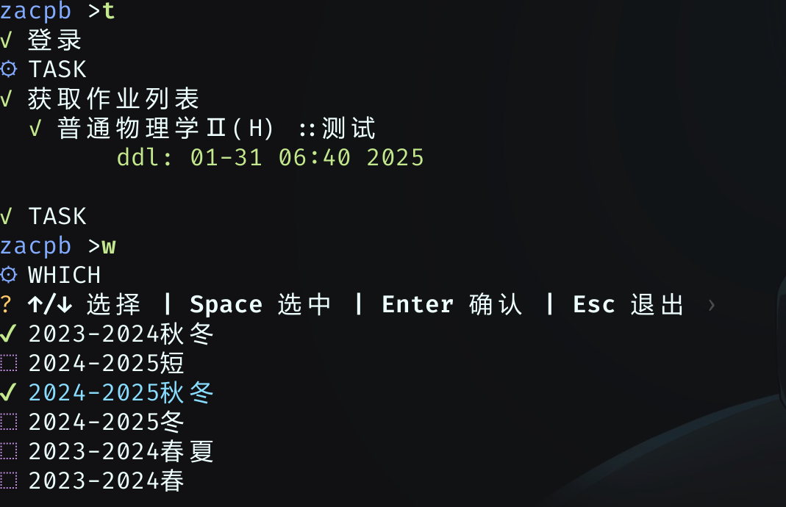
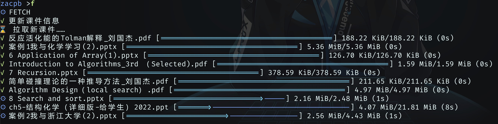
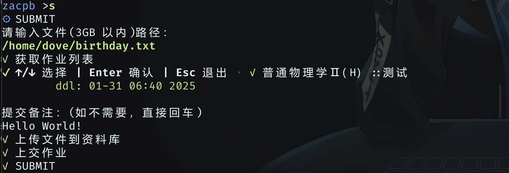

# ZAC (Zju-Assistant-Cli)

一个用于代替雪灾浙大网页端的命令行操作工具，支持拉取课件，提交作业。

## Why?

* 首先，雪灾浙大它很慢，我又是急性子！

* 其次，有前辈的项目 (<https://github.com/PeiPei233/zju-learning-assistant.git>) 可以参考，我又刚好想练习 rust！
* 再次，我是命令行爱好者!

## How to Use?

工具同时支持交互模式和一次性模式。

一次性模式用法如下：

```help
Usage: zac [OPTIONS]

Options:
  -f, --fetch    拉取课件
  -s, --submit   提交作业
  -u, --upgrade  更新课程列表，有新课时用
  -w, --which    选择需要拉取的课程
  -t, --task     查看作业
  -g, --grade    查看成绩
  -c, --config   配置[用户，存储目录，是否 ppt 转 pdf，是否下载 mp4 文件]
  -h, --help     Print help
  -V, --version  Print version
```

更为推荐的方法是不加参数使用命令/直接双击（什？），进入交互模式。针对交互模式做了预登录，可以略微减少等待时间。

交互模式可用的命令和一次性模式一致。

## Advanced Suggestions

作为命令行工具，推荐的是在终端中使用。本应用的主要耗时为登录雪灾浙大，而这一耗时可以通过保持应用开启避免。当这一耗时被避免，本应用可以保证所有相关操作速度快于雪灾浙大。而在资源占用上，应用待机消耗仅为 2MB，远低于浏览器消耗，相比终端本身的消耗也可以忽略不计。因此，在终端上开一个分网格给 zac/zacpb 是很好的方案。

另外，添加到环境变量，无需多言。

## Data Safety?

zac/zacpb 工具所有网络请求仅指向雪灾浙大，所有个人信息都储存在本地。

## Is the Upload Function Relieable?

上传功能已通过 3.15 GB zip 文件测试。

## Completer Supported?

所有的命令和路径输入均实现了自动补全功能，可以使用 tab 或 → 补全。

## Glimpse of Running

* 获取作业列表，选择要拉取的文件


* 拉取课件

* 上传作业


## How to Download?

Release中提供了构建好的 windows 版本和 linux 版本，其中带 pb 后缀的是带进度条特性构建结果。用户可依自己需求下载。

## How to Build?

在 linux 环境中克隆本项目。

对于 linux 版本，首先确保你拥有 rustc， cargo，然后在项目根目录使用

```bash
cargo build --release --features pb --target-dir target_linux_pb --bin zacpb
cargo build --release --target-dir target_linux_no_pb --bin zac
```

如果希望构建 windows 版本，则确保你拥有交叉编译工具 x86_64-w64-mingw32-gcc，并通过 rustup 添加目标 x86_64-pc-windows-gnu

```bash
# 示例：arch 系列
sudo pacman -S rustup mingw-w64-gcc
rustup update stable
rustup target add x86_64-pc-windows-gnu
```

然后，在项目根目录使用

```bash
cargo build --release --features pb --target-dir target_windows_pb --target x86_64-pc-windows-gnu --bin zacpb
cargo build --release --target-dir target_windows_no_pb
```

如果直接在 Github 克隆本项目，则可以直接使用本项目的 workflows 文件获取不同平台构建结果。

## Known Issues

* 当打开了 zac 并调整终端大小时，可能导致程序崩溃。该问题可能由 rustyline 引起，暂未找到解决方案。

```rust
assertion failed: fd != u32::MAX as RawFd
```

* zac 未购买 CA 签名，下载时可能被 defender 拦截，此为正常现象，请信任 zac（保留，加入白名单）。
